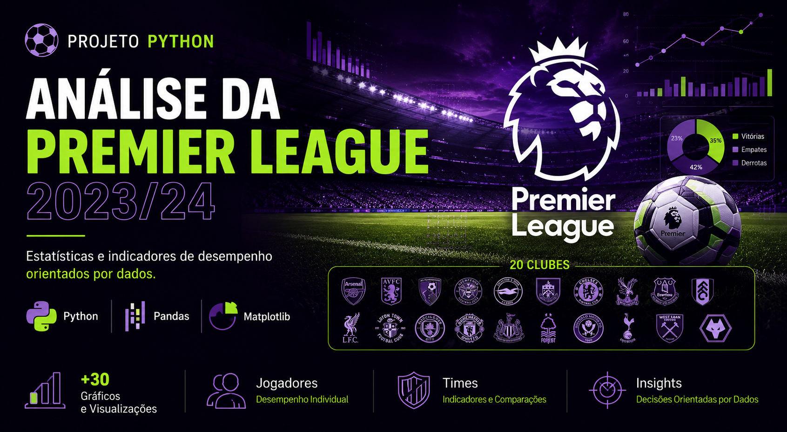

# ⚽ Análise da Premier League 2023/24 — Projeto Python
*Python • Pandas • Matplotlib • Análise de Dados*



Este projeto explora estatísticas da temporada 2023/24 da Premier League, utilizando Python para realizar análises exploratórias e gerar visualizações sobre o desempenho dos clubes e jogadores ao longo da competição.

As análises foram desenvolvidas com foco na identificação de padrões estatísticos e na interpretação de indicadores de desempenho.

---

## 🧠 Principais Habilidades

* Python para análise de dados
* Manipulação e tratamento de dados com Pandas
* Visualização de dados com Matplotlib
* Análise exploratória (EDA)
* Storytelling com dados
* Interpretação de indicadores esportivos

---

## 📊 Principais Análises Desenvolvidas

### ⚽ Estatísticas Ofensivas

* Gols marcados;
* Assistências;
* Participações em gols;
* Progressões ofensivas.

### 🛡️ Estatísticas Defensivas

* Cartões amarelos e vermelhos;
* Indicadores disciplinares;
* Comparações entre equipes.

### 📈 Visualizações

* Boxplots;
* Histogramas;
* Gráficos de barras;
* Gráficos de dispersão;
* Gráficos de setores.

### 🔎 Exploração dos Dados

* Comparações entre clubes;
* Destaques individuais;
* Distribuição das estatísticas;
* Identificação de padrões ao longo da temporada.

---

## 🛠 Ferramentas Utilizadas

* Python
* Pandas
* Matplotlib
* Seaborn
* Google Colab

---

## 📁 Estrutura do Projeto

```text
Notebook.ipynb
Base de Dados
Imagens
README.md
```

---

## 🚀 Como Utilizar

1. Abra o notebook no Google Colab ou Jupyter Notebook;
2. Execute as células sequencialmente;
3. Explore as análises e visualizações desenvolvidas.

---

⭐ Projeto desenvolvido para fins de estudo e composição de portfólio em Análise de Dados.
